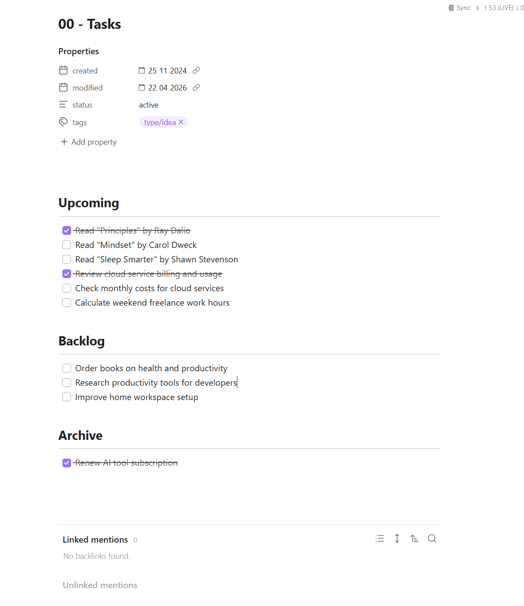
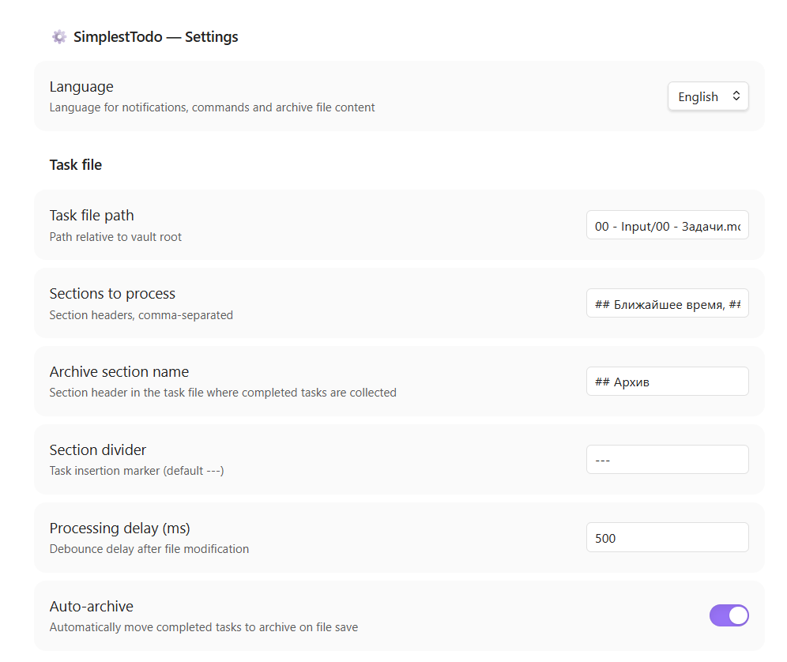
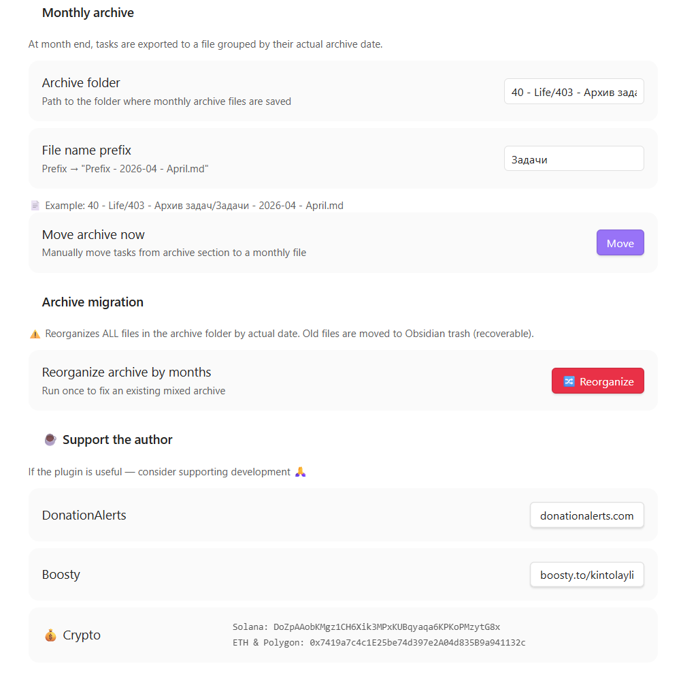

# Obsidian Simplest Todo

[English](#english) | [Русский](#русский) | [☕ Support / Поддержать](#support--поддержать)

---

## Screenshots / Скриншоты


*Main task list view / Основной вид списка задач*


*General settings / Общие настройки*


*Archive settings and support / Настройки архива и поддержка*

---

## English

A minimalist Obsidian plugin for managing tasks with automatic monthly archiving. Keep your task list clean — completed tasks move to a rolling archive automatically, organized by month into separate files.

### Features

- ✅ **Auto-archive** — completed tasks (`- [x]`) are automatically moved to the archive section on save
- 📦 **Monthly rollover** — at month end, archived tasks are exported to a separate file (e.g. `Tasks - 2026-04 - April.md`)
- 📅 **Date-aware grouping** — tasks are filed into the correct monthly file based on their actual completion date
- ↩️ **Unarchive** — unchecking a task in the archive (`- [x]` → `- [ ]`) returns it to its original section
- 🌐 **Bilingual** — full Russian and English interface (settings, notices, archive file content, month names)
- 🎀 **Ribbon button** — one-click manual archive trigger
- ⌨️ **Command palette** — run archiving or monthly rollover via `Ctrl+P`
- 🔀 **Migration command** — reorganize an existing mixed archive into proper monthly files

### How It Works

The plugin monitors a single Markdown file. It expects named sections:

```markdown
## Upcoming
---
- [ ] Buy groceries
- [x] Call the dentist

## Someday
---
- [ ] Learn Portuguese

## Archive
---
```

When you check off a task, the plugin moves it to the archive section with a hidden completion date tag. At month end it exports all archived tasks to a monthly file.

### Monthly Archive Files

```
📁 Archive Folder/
   Tasks - 2025-02 - February.md
   Tasks - 2025-03 - March.md
   Tasks - 2026-04 - April.md   ← current month
```

Each file contains a clean bullet list with completion dates:

```markdown
# Task Archive — April 2026

> Archived: 01.05.2026

---

- Buy groceries *(22.04.2026)*
- Call the dentist *(18.04.2026)*
```

### Installation

**Manual:**
1. Download `main.js` and `manifest.json` from the [latest release](../../releases/latest)
2. Create: `<vault>/.obsidian/plugins/obsidian-simplest-todo/`
3. Copy both files into it
4. **Settings → Community plugins → Reload plugins**, then enable **Simplest Todo**

**BRAT:**
1. Install [BRAT](https://github.com/TfTHacker/obsidian42-brat)
2. Add this repo via **BRAT → Add Beta Plugin**

### Configuration

| Setting | Default | Description |
|---|---|---|
| Language | `Russian` | UI language: Russian or English |
| Task file path | `00 - Input/000 - Tasks.md` | Path relative to vault root |
| Sections to process | `## Upcoming, ## Someday` | Comma-separated section headers to watch |
| Archive section name | `## Archive` | Section header where completed tasks collect |
| Section divider | `---` | Insertion point marker within sections |
| Processing delay | `500` ms | Debounce after file modification |
| Auto-archive | `on` | Enable/disable automatic archiving on save |
| Archive folder | `00 - Input/Archive` | Folder for monthly archive files |
| File prefix | `Tasks` | Archive filename prefix → `Tasks - 2026-04 - April.md` |

### Commands

| Command | Description |
|---|---|
| **Archive completed tasks** | Manually trigger archiving now |
| **Move archive to monthly file** | Force monthly rollover |
| **Reorganize archive by months** | One-time migration: rebuild monthly files by actual completion date |

### Notes

- `data.json` stores your personal settings and is excluded via `.gitignore` — configure paths after install
- Monthly rollover is checked on every plugin load and file save — no need to keep Obsidian open at midnight

### License

MIT

---

## Русский

Минималистичный плагин для Obsidian: управление задачами с автоматической ежемесячной архивацией. Список задач остаётся чистым — выполненные задачи автоматически перемещаются в архив и группируются по месяцам в отдельные файлы.

### Возможности

- ✅ **Автоархивация** — выполненные задачи (`- [x]`) автоматически перемещаются в секцию архива при сохранении файла
- 📦 **Месячный перенос** — по окончании месяца задачи экспортируются в отдельный файл (например `Задачи - 2026-04 - Апрель.md`)
- 📅 **Группировка по дате** — задачи попадают в файл того месяца, когда были фактически выполнены
- ↩️ **Восстановление** — снятие галочки с задачи в архиве возвращает её в исходную секцию
- 🌐 **Двуязычный интерфейс** — полная поддержка русского и английского: уведомления, команды, содержимое архивных файлов, названия месяцев
- 🎀 **Кнопка на панели** — ручная архивация в один клик
- ⌨️ **Палитра команд** — запуск архивации и переноса через `Ctrl+P`
- 🔀 **Команда миграции** — реорганизация существующего смешанного архива по месяцам

### Как это работает

Плагин отслеживает один Markdown-файл с задачами. Ожидаемая структура:

```markdown
## Ближайшее время
---
- [ ] Купить продукты
- [x] Позвонить врачу

## Без срока
---
- [ ] Выучить португальский

## Архив
---
```

При отметке задачи выполненной плагин перемещает её в секцию архива со скрытой датой. По окончании месяца все задачи из архива экспортируются в отдельный файл.

### Файлы месячного архива

```
📁 Папка архива/
   Задачи - 2025-02 - Февраль.md
   Задачи - 2025-03 - Март.md
   Задачи - 2026-04 - Апрель.md   ← текущий месяц
```

Каждый файл содержит чистый список задач с датами выполнения:

```markdown
# Архив задач — Апрель 2026

> Перенесено: 01.05.2026

---

- Купить продукты *(22.04.2026)*
- Позвонить врачу *(18.04.2026)*
```

### Установка

**Вручную:**
1. Скачайте `main.js` и `manifest.json` из [последнего релиза](../../releases/latest)
2. Создайте папку: `<хранилище>/.obsidian/plugins/obsidian-simplest-todo/`
3. Скопируйте оба файла в неё
4. **Настройки → Сторонние плагины → Перезагрузить плагины**, затем включите **Simplest Todo**

**BRAT:**
1. Установите [BRAT](https://github.com/TfTHacker/obsidian42-brat)
2. Добавьте репозиторий через **BRAT → Add Beta Plugin**

### Настройки

| Параметр | Значение по умолчанию | Описание |
|---|---|---|
| Язык интерфейса | `Русский` | Язык уведомлений, команд и архивных файлов |
| Путь к файлу задач | `00 - Input/000 - Задачи.md` | Путь относительно корня хранилища |
| Обрабатываемые секции | `## Ближайшее время, ## Без срока` | Заголовки секций через запятую |
| Название секции архива | `## Архив` | Заголовок секции для выполненных задач |
| Разделитель секций | `---` | Маркер точки вставки новых задач |
| Задержка обработки | `500` мс | Дебаунс после изменения файла |
| Автоматическая архивация | `вкл` | Архивировать при каждом сохранении |
| Папка архива | `00 - Input/Архив` | Папка для месячных архивных файлов |
| Префикс имени файла | `Задачи` | Префикс → `Задачи - 2026-04 - Апрель.md` |

### Команды

| Команда | Описание |
|---|---|
| **Архивировать выполненные задачи** | Запустить архивацию вручную прямо сейчас |
| **Перенести архив в месячный файл** | Принудительный месячный перенос |
| **Реорганизовать архив по месяцам** | Разовая миграция: пересобрать файлы архива по фактическим датам |

### Примечания

- `data.json` хранит личные настройки и исключён из Git через `.gitignore` — после установки настройте пути самостоятельно
- Проверка месячного переноса выполняется при каждой загрузке плагина и при каждом сохранении файла

### Лицензия

MIT

---

## Support / Поддержать

If this plugin saves you time — consider supporting its development!  
Если плагин экономит ваше время — поддержите разработку!

### 💳 Fiat / Фиат

| Platform | Link |
|----------|------|
| DonationAlerts | [donationalerts.com/r/iliartmmedia](https://www.donationalerts.com/r/iliartmmedia) |
| Boosty | [boosty.to/kintolayli/donate](https://boosty.to/kintolayli/donate) |

### 💰 Crypto / Крипто

| Network | Address |
|---------|---------|
| **Solana** | `DoZpAAobKMgz1CH6Xik3MPxKUBqyaqa6KPKoPMzytG8x` |
| **ETH** | `0x7419a7c4c1E25be74d397e2A04d835B9a941132c` |
| **Polygon** | `0x7419a7c4c1E25be74d397e2A04d835B9a941132c` |

Thank you! / Спасибо! 🙏
